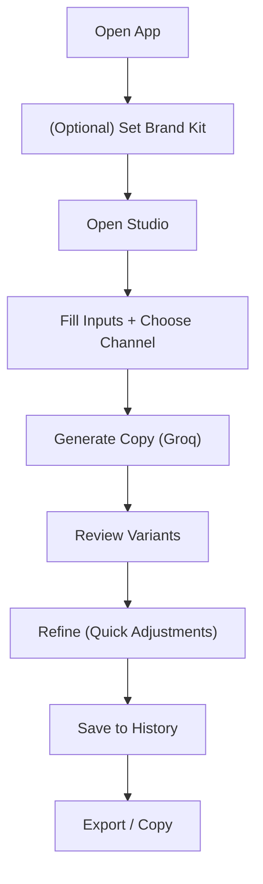

## 1. Product Overview
A lightweight marketing studio that generates channel-specific copy using Groq (free-tier friendly) and helps organize reusable brand context and past generations.
- Target users: solo founders, indie marketers, small teams
- Value: faster iteration on consistent, on-brand marketing assets without needing a full suite

## 2. Core Features

### 2.1 User Roles
Single user (no authentication in MVP).

### 2.2 Feature Module
1. **Studio**: generate marketing copy for a selected channel; refine with quick adjustments; save results
2. **Brand Kit**: save reusable brand context (product, audience, voice, forbidden claims, CTA style)
3. **History**: browse past generations; reuse prompts; export/copy as templates

### 2.3 Page Details
| Page Name | Module Name | Feature description |
|-----------|-------------|---------------------|
| Studio | Input panel | Product, audience, offer, tone/voice, goal, channel, language, compliance toggles |
| Studio | Generation controls | Generate, regenerate, “shorter/longer”, “more direct”, “more playful”, “add proof” |
| Studio | Output cards | Variants (A/B/C), hooks, CTA, hashtags (when relevant), subject lines (email) |
| Studio | Save/Export | Save to history; copy as plain text; export as JSON |
| Brand Kit | Brand profile | Persist defaults used in Studio; edit and save |
| Brand Kit | Guardrails | “Do not say” list; regulated category warning toggles; claim-safe mode |
| History | Timeline list | Filter by channel, goal, date; open a past run |
| History | Reuse | Load a run into Studio; duplicate with edits |

## 3. Core Process
Primary flow:
1) User configures Brand Kit defaults (optional)  
2) User opens Studio, chooses a channel (e.g., X, LinkedIn, Email, Landing page, Ads)  
3) User generates variants via Groq  
4) User refines using quick adjustments  
5) User saves best result to History and exports/copies

## 4. User Interface Design
### 4.1 Design Style
- Style direction: editorial studio + bold typography + high-contrast accents
- Primary colors: near-black background with warm paper panels; acid-lime accents
- Buttons: crisp, slightly oversized, with strong hover states and micro-motion
- Fonts: distinctive display serif for headings + readable sans for body
- Layout: two-column “studio” layout (inputs left, results right), desktop-first

### 4.2 Page Design Overview
| Page Name | Module Name | UI Elements |
|-----------|-------------|-------------|
| Studio | Layout | Left: stacked input sections; Right: result cards with “Copy”, “Save”, “Regenerate” |
| Brand Kit | Form | Field groups, tags for guardrails, persistent save confirmation |
| History | List + detail | Filter chips, timeline list, detail drawer or page |

### 4.3 Responsiveness
Desktop-first with a single-column fallback on mobile (inputs collapse into an accordion; results become stacked cards).

