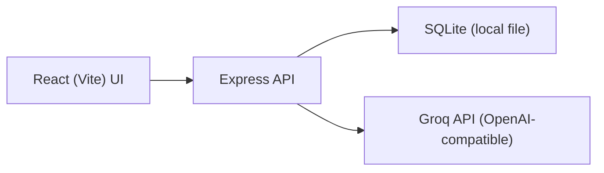
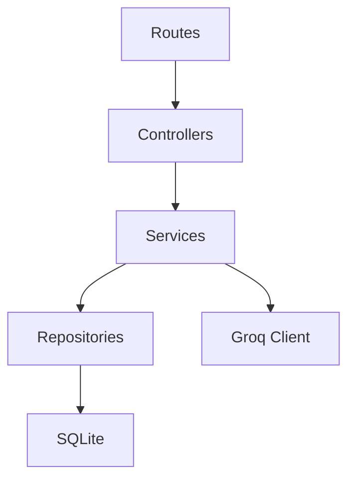
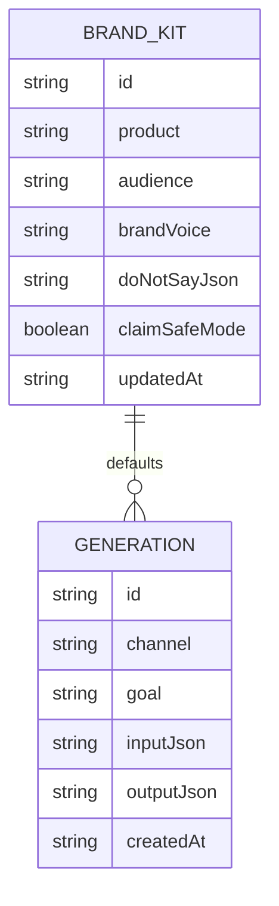

## 1. Architecture Design


## 2. Technology Description
- Frontend: React@18 + TypeScript + tailwindcss@3 + react-router-dom
- Backend: Express@4 (TypeScript) running in the same repo during dev
- Database: SQLite (file-based) for Brand Kit + History
- HTTP client: axios
- AI Provider: Groq OpenAI-compatible chat completions

## 3. Route Definitions
| Route | Purpose |
|-------|---------|
| / | Redirect to Studio |
| /studio | Main generation studio |
| /brand | Brand Kit management |
| /history | Past generations browsing |

## 4. API Definitions
### 4.1 Types
```ts
export type Channel =
  | "x"
  | "linkedin"
  | "email"
  | "landing"
  | "ads"
  | "instagram";

export type GenerateRequest = {
  channel: Channel;
  product: string;
  audience: string;
  offer?: string;
  goal: string;
  brandVoice?: string;
  language?: string;
  guardrails?: {
    doNotSay?: string[];
    claimSafeMode?: boolean;
  };
  knobs?: {
    length?: "short" | "medium" | "long";
    tone?: "direct" | "playful" | "luxury" | "warm" | "technical";
  };
};

export type GenerateResponse = {
  provider: "groq";
  model: string;
  createdAt: string;
  output: {
    variants: Array<{ title: string; body: string }>;
    extras?: Record<string, unknown>;
    raw?: string;
  };
};
```

### 4.2 Endpoints
| Method | Path | Purpose |
|--------|------|---------|
| POST | /api/generate | Generate marketing copy via Groq |
| GET | /api/brand | Get Brand Kit |
| PUT | /api/brand | Save Brand Kit |
| GET | /api/history | List saved generations |
| GET | /api/history/:id | Fetch one generation |
| POST | /api/history | Save a generation |

## 5. Server Architecture Diagram


## 6. Data Model
### 6.1 Data Model Definition


### 6.2 Data Definition Language
```sql
CREATE TABLE IF NOT EXISTS brand_kit (
  id TEXT PRIMARY KEY,
  product TEXT NOT NULL,
  audience TEXT NOT NULL,
  brand_voice TEXT,
  do_not_say_json TEXT,
  claim_safe_mode INTEGER NOT NULL DEFAULT 0,
  updated_at TEXT NOT NULL
);

CREATE TABLE IF NOT EXISTS generations (
  id TEXT PRIMARY KEY,
  channel TEXT NOT NULL,
  goal TEXT NOT NULL,
  input_json TEXT NOT NULL,
  output_json TEXT NOT NULL,
  created_at TEXT NOT NULL
);
CREATE INDEX IF NOT EXISTS idx_generations_created_at ON generations(created_at);
CREATE INDEX IF NOT EXISTS idx_generations_channel ON generations(channel);
```

